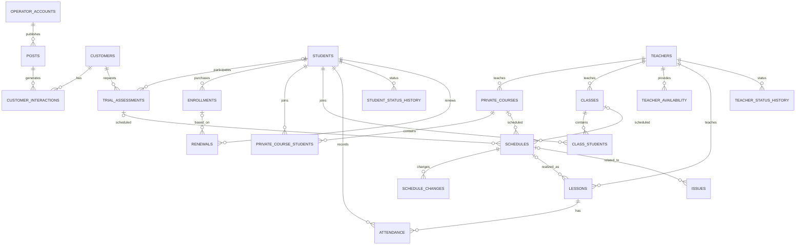

# 教育运营数据管理与分析项目

# 05 数据模型设计

> Data Model Design  
> Phase 3 — Logical Data Modeling

---

## 1. 文档目的

本文件在以下项目成果基础上进一步完成数据模型设计：

* `01_项目章程.md`：定义项目范围、P1–P5 核心痛点和项目目标；
* `02_当前状态分析.md`：说明市场、销售、教务和课程交付当前实际如何运行；
* `03_数据资产盘点.md`：确认当前有哪些原始数据、数据粒度、关联方式和数据缺口；
* `04_数据字典.xlsx`：定义标准化字段、业务实体、关系草案和业务规则；

本文件重点定义：

* 核心业务实体；
* 业务事件；
* 多对多关系；
* 历史状态；
* 主键与外键；
* 数据粒度；
* 主要唯一约束；
* 时间与时区规则；
* 排课和教师资源关系；
* 数据质量约束；
* Raw → Standardized 的映射关系；
* 后续 SQL / Power BI 所需要的分析层结构。

---

# 2. 模型设计目标

数据模型需要直接回应项目中已经识别出的 P1–P5。

| 痛点 | 数据模型需要解决的问题 | 主要设计方式 |
| --- | --- | --- |
| P1 数据分散 | 同一业务对象分布在大量文件中，无法稳定贯通 | 统一实体、统一 ID、集中关系模型 |
| P2 业务对象与数据结构不匹配 | Customer、Interaction、Student、Enrollment、Course、Lesson 等粒度混合 | 将主体、事件和关系拆分 |
| P3 历史过程丢失 | 当前值覆盖过去值 | 独立历史表和事件表 |
| P4 跨部门目标脱节 | 客户偏好、销售承诺、教师资源和最终排课无法比较 | 教师可用时间 + 排课确认 + 变更历史 |
| P5 高度人工化 | 重复录入、时差错误、排课冲突、统计口径漂移 | 标准字段、数据约束、统一时间规则、可重复 SQL 计算 |

因此，本项目的数据模型不是单纯为了减少表格数量。

其主要目标是建立：

```text
统一业务主体
        +
稳定业务关系
        +
不可丢失的业务事件
        +
可追踪的历史变化
        ↓
可重复的数据分析基础
```

---

# 3. 数据架构分层

为了避免将原始数据、清洗结果和分析结果混在同一层，本项目采用三层结构。

```text
Raw Layer
原始 / 模拟原始业务文件
        ↓
Python Cleaning & ETL
        ↓
Standardized Relational Layer
标准化关系模型
        ↓
SQL Views / Analysis Layer
分析视图与快照
        ↓
Power BI
```

---

## 3.1 Raw Layer

Raw Layer 对应当前实际工作中分散的 Excel / Google Sheets 结构。

主要包括：

* 小红书客户咨询表；
* 小红书运营帖子表；
* 试听课对接表；
* 等级测试表；
* 学生汇总表；
* 已停课 / 已完成学生表；
* 学生课程记录表；
* 班课文件；
* 私教课程文件；
* 课程安排表；
* 异常事件记录表；
* 教务团队奖金评分数据；
* 月度汇总统计；
* 教师可用时间月度快照（模拟数据辅助场景）。

Raw Layer 的原则是：

> **尽量保留原始状态，不在原始层直接覆盖或“修正”业务数据。**

即使存在：

* 重复行；
* 字段命名不一致；
* 同一学生不同写法；
* 同一课程类型不同写法；
* 缺失 ID；
* 时差计算错误；
* 教师排课重叠；
* 不同部门状态定义不一致；

也应该首先保留。

这些问题由后续 Python 数据清洗阶段识别和处理。

---

## 3.2 Standardized Relational Layer

Standardized Layer 是本文件的核心。

该层的目标是：

> 将原始文件中的业务信息重新组织为稳定的实体、关系、事件和历史记录。

这一层将作为：

* SQL 数据库；
* 数据质量检查；
* 业务指标计算；
* Power BI 数据源；

的主要基础。

---

## 3.3 Analysis Layer

Analysis Layer 不直接保存所有业务原始事实。

该层主要由：

* SQL View；
* 聚合查询；
* 月度快照；
* KPI 表；
* Power BI Semantic Model；

组成。

例如：

* 月度试听数量；
* 月度转化率；
* 教师月度可用容量；
* 排课变更数量；
* 教师负荷；
* 学生留存；
* 教师新增 / 停止授课；
* 班级开班率。

这些指标原则上应优先：

> 从 Standardized Layer 的明细事实重新计算。

而不是直接信任历史 Excel 中已经保存的汇总数字。

---

# 4. 数据对象分类

为了明确每张表的作用，本项目将标准化数据对象分为五类。

---

## 4.1 主体实体 Entity

代表相对稳定存在的业务对象。

包括：

* 运营账号；
* 广告帖子；
* 客户；
* 学生；
* 教师；
* 内部员工；
* 私教课程组；
* 班级。

主体实体回答：

> “这个对象是谁 / 是什么？”

---

## 4.2 业务事件 Event

代表某一时间实际发生的业务行为。

包括：

* 客户咨询；
* 试听 / 测试；
* 报名；
* 排课；
* 排课变更；
* 单次课程；
* 续费；
* 异常事件。

业务事件回答：

> “发生了什么？”

---

## 4.3 业务关系 Relationship

代表多个主体之间的长期或阶段性关系。

包括：

* 私教课程组—学生；
* 班级—学生；
* 课程—学生出勤。

业务关系回答：

> “谁在什么时期与谁形成了什么关系？”

---

## 4.4 历史状态 History

用于解决原电子表格直接覆盖当前值的问题。

包括：

* 学生状态历史；
* 教师状态历史；
* 排课变更历史；
* 教师可用时间生效区间。

历史表回答：

> “什么时候从什么状态变成什么状态？”

---

## 4.5 派生分析对象 Analytics

由业务明细重新计算产生。

主要包括：

* 月度业务指标；
* 教师月度容量快照；
* 转化漏斗；
* 学生生命周期指标；
* 排课质量指标。

---

# 5. 核心模型总览

本项目 Standardized Layer 主要包括以下数据对象。

| 编号 | 数据对象 | 类型 | 一行代表什么 | 主要解决痛点 |
| --- | --- | --- | --- | --- |
| 01 | `operator_accounts` | 实体 | 一个运营账号 | P1 / P2 |
| 02 | `posts` | 实体 / 内容 | 一个广告或运营帖子 | P2 |
| 03 | `customers` | 实体 | 一个唯一客户 | P1 / P2 |
| 04 | `customer_interactions` | 事件 | 一次客户咨询 / 互动 | P2 |
| 05 | `employees` | 实体 | 一个内部员工 | P2 / P4 |
| 06 | `teachers` | 实体 | 一个教师 | P2 / P4 |
| 07 | `trial_assessments` | 事件 | 一次试听或等级测试 | P2 / P4 |
| 08 | `students` | 实体 | 一个学生 | P1 / P2 |
| 09 | `enrollments` | 事件 / 关系 | 一次正式报名 / 购买 | P2 / P3 |
| 10 | `private_courses` | 实体 | 一个私教课程组 | P2 / P3 |
| 11 | `private_course_students` | 关系 | 一个学生加入一个私教组 | P2 / P3 |
| 12 | `classes` | 实体 | 一个班级 | P1 / P2 |
| 13 | `class_students` | 关系 | 一个学生加入一个班级 | P2 / P3 |
| 14 | `teacher_availability` | 状态 / 历史 | 教师一段有效可用时间 | P3 / P4 |
| 15 | `schedules` | 事件 / 状态 | 一次正式排课 | P3 / P4 / P5 |
| 16 | `schedule_changes` | 历史事件 | 一次排课变更 | P3 / P5 |
| 17 | `lessons` | 事件 | 一次实际课程 | P2 / P3 |
| 18 | `attendance` | 关系 / 事件 | 一个学生在一节课的出勤 | P2 / P3 |
| 19 | `student_status_history` | 历史 | 一次学生状态区间 / 变化 | P3 |
| 20 | `teacher_status_history` | 历史 | 一次教师状态变化 | P4 |
| 21 | `renewals` | 事件 | 一次续费 | P3 |
| 22 | `issues` | 事件 | 一次运营异常 | P4 / P5 |
| 23 | `teacher_monthly_capacity_snapshot` | 分析快照 | 教师在某月的容量状态 | P4 / P5 |
| 24 | `monthly_metrics` | 派生分析 | 一个月的一组业务指标 | P4 / P5 |

---

# 6. 总体实体关系

以下 ERD 展示核心业务链。



---

# 7. 市场与销售域模型

## 7.1 `operator_accounts`

### 业务含义

表示一个运营账号。

### 粒度

```text
一行 = 一个运营账号
```

### 核心字段

| 字段 | 说明 |
| --- | --- |
| `account_id` | 主键 |
| `account_name` | 账号名称 |
| `platform` | 平台 |
| `operator_id` | 运营负责人 |
| `active_status` | 当前是否在使用 |

### 主要关系

```text
employees
    1
    ↓
operator_accounts
    1
    ↓
posts
```

### 主要约束

建议：

```text
UNIQUE(account_name, platform)
```

原因是：

> 同一个平台中不应重复建立完全相同的运营账号主体。

---

## 7.2 `posts`

### 粒度

```text
一行 = 一个帖子
```

### 核心字段

* `post_id` — PK；
* `account_id` — FK；
* `operator_id` — FK；
* `post_name`；
* `publish_date`；
* `impression`；
* `click_count`。

### 设计说明

原始运营帖子表同时包含：

* 帖子表现；
* 账号总曝光；
* 账号总粉丝；

等不同粒度数据。

标准化模型中：

> `posts` 只保存帖子层级事实。

账号整体数据应放在：

* 账号快照；
* 月度统计；
* 分析视图；

中处理，而不重复存入每一条帖子记录。

---

## 7.3 `customers`

### 粒度

```text
一行 = 一个去重后的客户主体
```

### 核心字段

* `customer_id` — PK；
* `customer_account`；
* `source_channel`；
* `sales_id`；
* `status`；
* `create_date`。

### 设计目的

解决：

```text
一次咨询记录
≠
一个唯一客户
```

的问题。

原始客户账号可能存在：

* 大小写差异；
* 前后空格；
* `@`；
* 不同平台格式；
* 部门间不同写法。

因此 `customer_id` 是：

> 标准化后的内部唯一 ID。

不能简单假设原始 `customer_account` 天然唯一。

---

## 7.4 `customer_interactions`

### 粒度

```text
一行 = 一次客户咨询 / 互动事件
```

### 主外键

* `inquiry_id` — PK；
* `customer_id` — FK → `customers`；
* `post_id` — FK → `posts`；
* `account_id` — FK → `operator_accounts`；
* `sales_id` — FK → `employees`。

### 业务价值

可以表达：

```text
一个 Customer
↓
多次 Interaction
```

因此后续可以分别计算：

* 互动次数；
* 唯一客户数；
* 重复咨询率；
* 来源渠道；
* 响应时间；
* 后续试听率。

---

# 8. 人员模型

## 8.1 `employees`

### 粒度

```text
一行 = 一个内部工作人员
```

### 主要字段

* `employee_id` — PK；
* `employee_name`；
* `role`；
* `active_status`。

### 角色

例如：

* 销售；
* 教务；
* 运营；
* 管理。

### 设计原因

Raw Layer 中大量使用：

> 员工姓名

作为业务关联。

标准化以后：

> 业务关系使用 `employee_id`。

员工姓名仍保留用于展示。

---

## 8.2 `teachers`

### 粒度

```text
一行 = 一个教师
```

### 主要字段

* `teacher_id` — PK；
* `teacher_name`；
* `timezone`；
* `teaching_mode`；
* `current_status`。

### 为什么不与 `employees` 合并

本项目将教师和内部工作人员分开。

原因是：

* 教师属于课程交付资源；
* 教师有独立的可用时间；
* 教师承担课程和班级；
* 教师存在授课状态和容量分析；
* 内部员工主要负责销售、运营、教务和管理流程。

如果未来企业实际组织结构显示部分教师同时属于内部员工，可以再通过：

```text
employee_teacher_relation
```

或统一人员模型扩展。

当前 Portfolio 阶段不增加该复杂度。

---

# 9. 试听与学生模型

## 9.1 `trial_assessments`

### 粒度

```text
一行 = 一次试听或等级测试事件
```

### 核心字段

* `trial_id` — PK；
* `customer_id` — FK；
* `student_id` — FK，可为空；
* `trial_type`；
* `teacher_id`；
* `trial_date`；
* `level_result`；
* `teacher_feedback`；
* `confirmation_status`。

### 为什么 `student_id` 可以为空

在试听发生时：

> 客户可能尚未正式转化为标准 Student 主体。

因此业务链允许：

```text
Customer
↓
Trial
↓
正式报名
↓
Student
```

而不是强制：

```text
所有 Trial
必须提前存在 Student
```

---

## 9.2 客户偏好、销售承诺与教务确认

为了分析 P4，数据字典已经区分：

* `customer_preferred_time`；
* `sales_promised_time`；
* `academic_confirmed_time`；
* `confirmation_status`。

这三个字段不能视为同一个时间。

其业务含义分别是：

```text
客户希望什么时候上
        ↓
销售向客户说什么时候可以上
        ↓
教务最终确认什么时候真的可以上
```

模拟数据中，这些字段用于制造：

* 销售承诺与教师资源不一致；
* 后续重新协调；
* 排课变化增加；

等场景。

正式历史数据是否能够恢复这些字段，需要在 ETL 阶段按实际数据质量决定。

---

## 9.3 `students`

### 粒度

```text
一行 = 一个稳定学生主体
```

### 主要字段

* `student_id` — PK；
* `student_name`；
* `country`；
* `timezone`；
* `age`；
* `sales_id`；
* `academic_id`；
* `status`。

### 注意

`status` 仅用于：

> 当前状态快速查询。

完整历史不能依赖该字段。

真正生命周期分析使用：

```text
student_status_history
```

---

# 10. 报名模型

## 10.1 `enrollments`

### 粒度

```text
一行 = 一次正式报名 / 一次课程购买
```

### 核心字段

* `enrollment_id` — PK；
* `student_id` — FK；
* `enrollment_date`；
* `course_mode`；
* `private_course_id`；
* `class_id`；
* `purchased_hours`；
* `sales_id`；
* `academic_id`；
* `status`。

### 为什么 Enrollment 不能合并进 Student

同一个学生可能：

```text
第一次报名
↓
完成课程
↓
续费
↓
换课程
↓
再次报名
```

因此：

```text
Student 1
    ↓
Enrollment N
```

---

## 10.2 课程关系约束

当：

```text
course_mode = 私教
```

则：

```text
private_course_id NOT NULL
class_id NULL
```

当：

```text
course_mode = 班课
```

则：

```text
class_id NOT NULL
private_course_id NULL
```

后续 SQL 实现阶段应加入 CHECK 逻辑或 ETL 校验。

---

# 11. 私教课程模型

## 11.1 `private_courses`

### 粒度

```text
一行 = 一个长期私教课程组
```

不是：

```text
一行 = 一个学生
```

也不是：

```text
一行 = 一次课程
```

### 主要字段

* `private_course_id` — PK；
* `course_type`；
* `teacher_id`；
* `schedule`；
* `current_status`；
* `start_date`。

---

## 11.2 为什么不能在私教主表直接放一个 `student_id`

业务中私教包括：

* 1V1；
* 1V2；
* 1V3；
* 1V4。

如果：

```text
private_courses.student_id
```

只能存一个学生，则无法自然表达：

```text
PC001
├── Student A
├── Student B
└── Student C
```

因此使用：

```text
private_course_students
```

关系表。

---

## 11.3 `private_course_students`

### 粒度

```text
一行 = 一个学生在某一时期加入一个私教组
```

### 字段

* `private_course_student_id` — PK；
* `private_course_id` — FK；
* `student_id` — FK；
* `join_date`；
* `leave_date`；
* `status`。

### 唯一约束建议

同一学生在同一课程组同一有效周期不能产生无意义重复。

至少在清洗阶段检查：

```text
private_course_id
+
student_id
+
join_date
```

重复情况。

---

# 12. 班课模型

## 12.1 `classes`

### 粒度

```text
一行 = 一个班级
```

### 字段

* `class_id` — PK；
* `class_name`；
* `teacher_id`；
* `schedule`；
* `level`；
* `delivery_mode`；
* `status`。

### 设计价值

Raw Layer 中业务扩展方式接近：

```text
新增班级
↓
新增文件
```

Standardized Layer 改为：

```text
新增班级
↓
新增一条 classes 记录
```

从结构上解决 P1。

---

## 12.2 `class_students`

### 粒度

```text
一行 = 一个学生在某个时期属于一个班级
```

### 字段

* `class_student_id`；
* `class_id`；
* `student_id`；
* `join_date`；
* `leave_date`；
* `status`。

### 为什么需要历史关系

学生可能：

```text
加入班级
↓
转班
↓
退出
↓
重新加入
```

如果 `classes` 中直接保存学生名单，则无法稳定保存成员历史。

---

# 13. 教师可用时间模型

## 13.1 `teacher_availability`

### 业务目的

用于表达：

> 教师在某一有效日期范围内，哪些时间可以接受新的课程安排。

### 粒度

```text
一行 = 某教师的一段可用时间规则
```

例如：

```text
Teacher T001
Sunday
09:00–12:00
Europe/Madrid
2026-06-01 至 2026-06-30
```

---

## 13.2 核心字段

* `availability_id` — PK；
* `teacher_id` — FK；
* `weekday`；
* `start_time`；
* `end_time`；
* `timezone`；
* `effective_from`；
* `effective_to`；
* `status`。

---

## 13.3 为什么使用生效日期

不能只保存：

```text
Teacher A
Sunday 09:00–12:00
```

因为教师可用时间可能逐月变化。

例如模拟数据中设计：

```text
2026-06
可用时间较多
    ↓
2026-07
明显下降
    ↓
2026-08
继续下降
```

如果直接覆盖当前可用时间，则无法分析：

> 教师资源是否在一段时间内逐渐被压缩。

因此：

```text
effective_from
effective_to
```

必须保留。

---

# 14. 排课模型

排课是整个模型中最关键的业务事件之一。

它连接：

```text
课程
+
教师
+
时间
+
销售承诺
+
教务确认
+
实际课程
```

---

## 14.1 `schedules`

### 粒度

```text
一行 = 一次正式或待确认的课程安排
```

### 核心字段

* `schedule_id` — PK；
* `course_mode`；
* `private_course_id`；
* `class_id`；
* `trial_id`；
* `teacher_id`；
* `customer_preferred_time`；
* `sales_promised_time`；
* `confirmed_start`；
* `confirmation_status`；
* `confirmed_by`；
* `confirmed_at`。

---

## 14.2 对 `04_数据字典.xlsx` 的一处模型修正

数据字典中的 `schedules.course_mode` 已经允许：

```text
私教 / 班课 / 试听
```

但原草案只有：

* `private_course_id`；
* `class_id`；

没有可以关联试听事件的字段。

因此 `05 数据模型设计` 正式补充：

```text
trial_id
```

作为可选外键：

```text
trial_id → trial_assessments.trial_id
```

这样：

```text
course_mode = 试听
```

时可以明确知道这次排课属于哪一次试听 / 测试事件。

---

## 14.3 排课对象互斥规则

一条排课记录只能主要对应一个业务对象。

例如：

### 私教

```text
private_course_id NOT NULL
class_id NULL
trial_id NULL
```

### 班课

```text
class_id NOT NULL
private_course_id NULL
trial_id NULL
```

### 试听

```text
trial_id NOT NULL
private_course_id NULL
class_id NULL
```

后续可以通过 SQL CHECK 或 ETL validation 实现。

---

# 15. 排课变更历史

## 15.1 `schedule_changes`

### 粒度

```text
一行 = 一次排课变更事件
```

### 字段

* `schedule_change_id` — PK；
* `schedule_id` — FK；
* `change_time`；
* `old_start`；
* `new_start`；
* `change_reason`；
* `initiator_type`；
* `changed_by`。

---

## 15.2 为什么必须独立建表

原 Spreadsheet 常见维护方式是：

```text
原时间：10:00
↓
直接修改单元格
↓
新时间：11:00
```

修改后：

> 10:00 消失。

标准化模型改为：

```text
schedules
保存当前最终安排

schedule_changes
保存每一次变化
```

因此：

```text
Schedule 1
    ↓
Schedule Change N
```

可以回答：

* 一门课程改了多少次；
* 谁提出修改；
* 修改原因；
* 哪些月份改课明显增加；
* 哪些教师承担更多调整；
* 销售承诺冲突是否更容易产生改课。

---

# 16. 时间和时区设计

当前业务涉及跨国家和跨时区学生与教师。

Raw Layer 中可能出现：

* 西班牙时间；
* 学生当地时间；
* 时差；
* 星期；
* 人工换算后的时间。

模拟数据还主动加入：

* 夏令时换算错误；
* 错误沿用旧时差；
* 人工时差计算错误。

因此标准化模型需要避免：

> 将人工计算的“学生当地时间”作为唯一权威时间。

---

## 16.1 权威时间原则

对于已经发生或正式确认的时间事件：

> **数据库内部优先使用标准时间戳作为权威值。**

推荐：

```text
UTC Timestamp
+
IANA Time Zone
```

例如：

```text
2026-08-10 16:00 UTC
Europe/Madrid
Asia/Shanghai
```

而不是只保存：

```text
西班牙 18:00
中国 00:00
时差 +6
```

---

## 16.2 Raw 时间必须保留

ETL 过程中不能直接删除原始时间。

建议 staging 中保留：

* `raw_local_time`；
* `raw_timezone_text`；
* `raw_offset`；
* `raw_student_local_time`。

同时生成：

* `standardized_utc_time`；
* `timezone_valid_flag`；
* `timezone_mismatch_flag`。

这样可以分析：

> 原始人工换算中到底有多少时差错误。

---

# 17. 课程执行模型

## 17.1 `lessons`

### 粒度

```text
一行 = 一次实际发生的课程
```

### 字段

* `lesson_id` — PK；
* `schedule_id` — FK；
* `teacher_id` — FK；
* `lesson_date`；
* `duration`；
* `feedback`。

### Schedule 与 Lesson 的区别

```text
Schedule
=
计划什么时候上

Lesson
=
最终实际发生了什么
```

因此：

```text
计划课程
↓
可能发生 0–N 次变更
↓
实际课程
```

---

## 17.2 关于 `lesson.student_id`

数据字典中为兼容历史源表保留了：

```text
student_id
```

但最终逻辑模型不建议依赖：

```text
lessons.student_id
```

表示课程成员。

原因是：

* 班课一节课有多个学生；
* 1V2 / 1V3 / 1V4 同样有多个学生。

因此统一通过：

```text
attendance
```

建立：

```text
Lesson
↔
Student
```

关系。

在历史迁移阶段，如果源数据是一行“学生 × 单节课”，可以暂时保留 `student_id` 作为：

> Source Mapping / Transitional Field

但后续分析模型应优先使用 Attendance。

---

# 18. 出勤模型

## 18.1 `attendance`

### 粒度

```text
一行 = 一个学生在一节实际课程中的出勤状态
```

### 字段

* `attendance_id` — PK；
* `lesson_id` — FK；
* `student_id` — FK；
* `attendance_status`；
* `remark`。

### 唯一约束

应保证：

```text
UNIQUE(lesson_id, student_id)
```

避免同一学生在同一节课被重复记录两次。

---

# 19. 学生生命周期历史

## 19.1 `student_status_history`

### 粒度

```text
一行 = 一个学生的一段状态记录 / 一次状态变化
```

### 字段

* `student_status_id`；
* `student_id`；
* `status`；
* `effective_from`；
* `effective_to`；
* `reason`；
* `recorded_by`。

---

## 19.2 状态示例

```text
2025-09-01
在读
        ↓
2026-01-15
暂停
        ↓
2026-02-10
在读
        ↓
2026-08-01
已完成
```

相比原始：

```text
学生当前状态 = 已完成
```

历史模型能够支持：

* 留存时间；
* 暂停次数；
* 恢复率；
* 停课时间；
* 生命周期分析。

---

# 20. 教师状态历史

## 20.1 `teacher_status_history`

### 粒度

```text
一行 = 一次教师状态变化
```

### 主要状态

例如：

* 授课中；
* 暂停；
* 停止授课；
* 离职。

### 字段

* `teacher_status_id`；
* `teacher_id`；
* `status`；
* `effective_date`；
* `reason`。

### 分析价值

用于观察：

* 新教师加入；
* 教师停止授课；
* 教师流失时间；
* 教师人数变化。

---

# 21. 续费模型

## 21.1 `renewals`

### 粒度

```text
一行 = 一次续费事件
```

### 字段

* `renewal_id`；
* `student_id`；
* `enrollment_id`；
* `renewal_date`；
* `renewal_hours`；
* `sales_id`；
* `remark`。

### 为什么续费不是 Student 当前字段

因为同一个学生可以：

```text
续费 1
续费 2
续费 3
```

如果只保存：

```text
是否续费 = 是
```

则无法分析：

* 续费次数；
* 续费时间；
* 每次续费课时；
* 生命周期价值变化。

---

# 22. 异常事件模型

## 22.1 `issues`

### 粒度

```text
一行 = 一次运营异常 / 问题事件
```

### 字段

* `issue_id`；
* `issue_date`；
* `category`；
* `related_student`；
* `owner`；
* `status`；
* `resolution`；
* `related_schedule_id`。

---

## 22.2 异常类型标准化

Raw 数据中可能出现：

```text
排课问题
排课
时间冲突
schedule issue
教师冲突
```

这些都可能描述相近问题。

后续 ETL 需要建立：

```text
Issue Taxonomy
```

例如：

| 标准异常类别 | Raw 示例 |
| --- | --- |
| `SCHEDULE_CONFLICT` | 时间冲突、排课冲突 |
| `TEACHER_UNAVAILABLE` | 教师没时间、老师不可用 |
| `TIMEZONE_ERROR` | 时差错误、时间换算错误 |
| `COMMUNICATION_ERROR` | 信息传递错误 |
| `STUDENT_CHANGE_REQUEST` | 学生改课 |
| `TEACHER_CHANGE_REQUEST` | 教师改课 |

---

# 23. 教师月度容量快照

## 23.1 为什么需要该分析对象

新版模拟数据中增加了：

```text
教师月度可用时间快照
```

用于体现：

```text
教师人数
≠
真实可用教师容量
```

例如：

```text
教师 Headcount 增加
但
原有教师剩余可用时间持续下降
```

这是 P4 / P5 分析的重要信号。

---

## 23.2 `teacher_monthly_capacity_snapshot`

该表属于：

> **Analysis Snapshot**

不是当前历史源文件天然存在的核心交易表。

### 粒度

```text
一行 = 一个教师在一个月份的容量快照
```

### 推荐字段

* `snapshot_month`；
* `teacher_id`；
* `teacher_status`；
* `teacher_start_date`；
* `new_teacher_flag`；
* `availability_slot_count`；
* `weekly_available_hours`；
* `scheduled_hours_in_month`；
* `estimated_monthly_capacity`；
* `remaining_available_hours`。

### 唯一键

```text
UNIQUE(snapshot_month, teacher_id)
```

---

## 23.3 数据来源

理想情况下由：

```text
teacher_availability
+
schedules / lessons
+
teacher_status_history
```

计算。

如果真实历史数据无法恢复教师过去的可用时间：

> 该指标不能被假装为真实历史事实。

在 Portfolio 的模拟数据中，可以用于展示分析方法。

在真实业务分析中，必须明确数据限制。

---

# 24. 月度指标模型

## 24.1 `monthly_metrics`

历史工作中已有部分月度统计。

例如：

* 试听数量；
* 转化率；
* 学生数量；
* 私教新增；
* 班课新增；
* 开班率。

但这些指标可能存在：

* 去重口径变化；
* 分子 / 分母变化；
* 手工计算；
* 不同月份定义不一致。

因此正式 SQL 分析中：

> 不直接将历史月度汇总表作为最终事实来源。

---

## 24.2 推荐方式

优先使用 SQL 重新计算：

```text
明细事实
↓
SQL
↓
Monthly Metrics View
```

历史汇总表主要用于：

> Reconciliation / 对账

即：

```text
SQL 重新计算结果
vs
历史月度报表
```

如果不一致，再检查统计口径。

---

# 25. 教师排课重叠规则

模拟数据中主动保留了：

> 同一教师在相同时间被安排多门课程

这种真实运营错误。

该问题不是：

> Raw CSV 格式错误

而是：

> 业务事实本身存在冲突。

因此不能在 ETL 中简单删除。

---

## 25.1 检测逻辑

需要检查同一：

```text
teacher_id
+
时间区间
```

是否发生重叠。

不能只检查：

```text
teacher_id
+
start_time
```

因为：

```text
10:00–11:30
```

与：

```text
11:00–12:00
```

同样发生冲突。

后续 SQL / Python 应按时间区间检测。

---

## 25.2 处理原则

发现重叠后：

* 不自动删除；
* 标记为 `schedule_conflict`；
* 与 `issues` 对照；
* 检查是否被业务人员发现；
* 分析冲突数量是否随教师容量下降而增加。

---

# 26. 数据重复与跨部门差异

模拟 Raw Layer 会出现：

```text
销售表：
Anna_023

教务表：
Anna023

运营表：
anna_023
```

以及：

```text
销售：
VIP一对一

教务：
1V1

运营：
单人私教
```

这些问题不能通过数据库约束直接解决。

需要在 ETL 过程中建立：

```text
Raw Value
↓
Normalization
↓
Entity Matching
↓
Standard ID
```

---

## 26.1 标准化映射

例如：

```text
VIP一对一
一对一
单人私教
私教
1V1
        ↓
COURSE_TYPE = 1V1
```

但原始值应保留。

建议 ETL 中保存：

```text
raw_course_type
standard_course_type
```

用于：

* 追踪映射；
* 调试；
* 数据质量统计。

---

# 27. 通用技术审计字段

由于本项目的数据来源高度分散，建议 Standardized Layer 的重要记录统一增加技术审计字段。

这些字段不属于业务字段，因此没有必要在 `04_数据字典.xlsx` 每个业务实体中重复列出。

建议包括：

| 字段 | 用途 |
| --- | --- |
| `source_file` | 数据来自哪个原始文件 |
| `source_sheet` | 原 Excel Sheet |
| `source_row_number` | 原始行号 |
| `load_batch_id` | ETL 批次 |
| `ingested_at` | 导入时间 |
| `updated_at` | 标准化记录最后更新时间 |
| `data_quality_flag` | 是否存在质量问题 |
| `record_hash` | 辅助识别重复记录 |

这些字段主要解决：

> 清洗后发现错误时，能否回到原始文件找到原记录。

---

# 28. 数据完整性约束

## 28.1 主键

所有核心表必须存在稳定主键。

例如：

```text
customers.customer_id
students.student_id
teachers.teacher_id
classes.class_id
private_courses.private_course_id
schedules.schedule_id
lessons.lesson_id
```

---

## 28.2 外键

核心业务关系使用 ID，而不是姓名。

例如：

```text
lessons.teacher_id
```

必须关联：

```text
teachers.teacher_id
```

而不能依赖：

```text
teacher_name
```

---

## 28.3 多对多关系必须拆表

以下关系不能直接存数组或逗号字符串。

### 私教

```text
Private Course
N ↔ N
Student
```

通过：

```text
private_course_students
```

---

### 班课

```text
Class
N ↔ N
Student
```

通过：

```text
class_students
```

---

### Lesson 与 Student

通过：

```text
attendance
```

---

# 29. 推荐唯一约束

建议至少检查以下业务唯一性。

```text
operator_accounts(account_name, platform)
```

```text
attendance(lesson_id, student_id)
```

```text
teacher_monthly_capacity_snapshot(snapshot_month, teacher_id)
```

对于：

```text
private_course_students
class_students
```

不建议只用：

```text
course_id + student_id
```

永久唯一。

原因是同一学生可能：

> 离开后重新加入。

因此应结合：

* join_date；
* 状态；
* 有效区间；

处理。

---

# 30. 历史区间规则

对于有效时间范围：

```text
effective_from
effective_to
```

需要满足：

```text
effective_from <= effective_to
```

并对同一主体检查：

> 是否存在不合理的重叠状态。

例如同一个学生不能同时：

```text
在读
和
已停课
```

除非业务规则明确允许。

---

# 31. Null 的使用原则

Null 不等于：

> 数据错误。

在历史数据迁移中，Null 可能代表：

* 历史没有记录；
* 无法恢复；
* 该字段当时不适用。

例如：

```text
sales_promised_time = NULL
```

可能表示：

> 历史数据无法确认销售是否曾承诺具体时间。

不能为了完整性人为补造。

这一原则与数据字典中的业务规则保持一致。

---

# 32. Raw → Standardized 映射总览

| Raw Source | Standardized Target |
| --- | --- |
| 小红书客户咨询表 | `customers` + `customer_interactions` |
| 小红书运营帖子表 | `operator_accounts` + `posts` |
| 试听课对接表 | `trial_assessments` + 部分 `schedules` |
| 等级测试表 | `trial_assessments` |
| 学生汇总表 | `students` + `enrollments` + `student_status_history` |
| 已停课 / 已完成学生表 | `student_status_history` + `renewals` |
| 私教文件 | `private_courses` + `private_course_students` |
| 班课文件 | `classes` + `class_students` |
| 课程安排表 | `teacher_availability` + `schedules` + `schedule_changes` |
| 学生课程记录表 | `lessons` + `attendance` |
| 异常事件记录表 | `issues` |
| 月度汇总统计 | 对账数据 / `monthly_metrics` |
| 教师可用时间月度快照 | `teacher_monthly_capacity_snapshot` |

---

# 33. 模型如何解决 P1–P5

## 33.1 P1：数据分散

原来：

```text
一个班级
=
一个文件
```

模型以后：

```text
一个班级
=
classes 中一行
```

原来：

```text
多个文件中的同一学生
```

模型以后：

```text
students.student_id
```

作为统一关联。

---

## 33.2 P2：业务对象混合

原来：

```text
客户
+
客户互动
```

模型：

```text
customers
+
customer_interactions
```

原来：

```text
学生
+
报名
+
当前课程
```

模型：

```text
students
+
enrollments
+
course relationship
```

---

## 33.3 P3：历史覆盖

原来：

```text
修改当前单元格
```

模型：

```text
student_status_history
schedule_changes
teacher_availability
teacher_status_history
```

---

## 33.4 P4：跨部门信息不透明

模型可以比较：

```text
customer_preferred_time
vs
sales_promised_time
vs
teacher_availability
vs
confirmed_start
```

以及：

```text
教师人数
vs
教师可用时间
vs
已排课课时
vs
剩余容量
```

---

## 33.5 P5：人工操作错误

可以自动检查：

* 重复客户；
* 重复课程记录；
* 非标准课程类型；
* 时差错误；
* 教师排课重叠；
* 学生状态冲突；
* 无效外键；
* 月度 KPI 口径差异。

---

# 34. 后续 SQL 分析能力

完成该模型后，SQL 应能够稳定回答以下问题。

---

## 34.1 市场与销售

* 每月唯一客户数是多少？
* 重复咨询率是多少？
* 哪些帖子带来更多有效客户？
* 咨询响应时间是否与试听有关？
* 试听 → 报名转化率是多少？

---

## 34.2 学生生命周期

* 每月新增学生多少？
* 当前在读多少？
* 停课率如何变化？
* 学生平均学习周期多长？
* 哪些学生续费？
* 续费次数和课时如何？

---

## 34.3 教务和排课

* 每月排课数量多少？
* 每月改课数量多少？
* 哪类课程更容易改课？
* 哪些教师出现更多时间冲突？
* 私教和班课的调整频率是否不同？

---

## 34.4 教师容量

* 教师人数如何变化？
* 新教师什么时候集中加入？
* 每个教师每月可用时间多少？
* 教师剩余容量是否逐月下降？
* 教师人数上升是否真的意味着可用容量增加？

---

## 34.5 跨部门业务案例

后续可以检查：

```text
教师容量下降
+
排课变更增加
+
时间冲突增加
+
新教师集中加入
+
异常事件增加
```

是否出现在同一时间窗口。

该结果可以支持：

> 运营压力变化分析。

但不能仅凭这些时间关系直接证明：

> 某一个部门行为导致了全部后果。

---

# 35. Power BI 建模方向

本项目当前不计划额外建立完整企业级 Data Warehouse。

Power BI 阶段优先采用：

```text
Standardized Relational Tables
        ↓
SQL Views
        ↓
Power BI Semantic Model
```

而不是再重新复制一整套物理数据仓库。

---

## 35.1 推荐事实视图

后续可以建立：

* `vw_customer_funnel`；
* `vw_trial_conversion`；
* `vw_student_lifecycle`；
* `vw_lesson_attendance`；
* `vw_teacher_workload`；
* `vw_schedule_quality`；
* `vw_teacher_capacity_monthly`；
* `vw_issue_trend`。

---

## 35.2 推荐公共维度

Power BI 可以进一步建立：

* Date；
* Student；
* Teacher；
* Employee；
* Course Type；
* Level；
* Delivery Mode；
* Issue Category。

这些可以在 Power BI 中形成星型语义模型，但当前阶段不需要提前物理复制为独立数据仓库表。

---

# 36. 数据模型范围边界

当前模型的目标是：

> 支持 Portfolio 中的 Python、SQL、Power BI 和业务分析。

不是：

* 完整 CRM；
* ERP；
* LMS；
* 实时排课系统；
* 教师人力资源系统；
* 财务系统。

因此暂不设计：

* 用户登录权限模型；
* 支付流水；
* 发票；
* 工资；
* 完整教材系统；
* Zoom / VOOV API；
* 自动消息系统；
* 实时课程预约算法。

这些可以作为未来扩展，而不是本阶段必须实现的内容。

---

# 37. 从 04 数据字典到 05 数据模型的主要调整

本阶段不是简单照抄数据字典，而是对逻辑关系进一步确认。

主要调整如下。

---

## 37.1 确认 Customer 与 Interaction 分离

状态：

> 正式确认。

```text
customers
1
↓
N
customer_interactions
```

---

## 37.2 确认 Student 与 Enrollment 分离

状态：

> 正式确认。

```text
students
1
↓
N
enrollments
```

---

## 37.3 确认私教课程组使用关系表

状态：

> 正式确认。

```text
private_courses
1
↓
N
private_course_students
N
↓
1
students
```

---

## 37.4 确认班级成员使用关系表

状态：

> 正式确认。

---

## 37.5 确认 Schedule 与 Schedule Change 分离

状态：

> 正式确认。

用于解决：

> 当前值覆盖历史。

---

## 37.6 补充 `schedules.trial_id`

状态：

> 05 阶段新增。

原因：

> `course_mode` 已支持试听，但原字典没有 Trial 外键。

---

## 37.7 Lesson 与 Student 关系调整

`04` 中保留 `lessons.student_id` 主要是为了兼容历史源表。

最终逻辑模型：

> Lesson 成员关系优先通过 `attendance`。

`student_id` 可作为迁移期兼容字段，而不是最终成员关系的唯一依据。

---

## 37.8 教师月度容量快照定位

`teacher_monthly_capacity_snapshot`：

> 定位为 Analysis Snapshot。

它不是用来替代：

```text
teacher_availability
```

而是用于快速分析教师容量变化。

---

# 38. 数据模型验证规则

进入下一阶段前，需要至少验证以下规则。

## 38.1 Entity Validation

* 每个 Student 有唯一 `student_id`；
* 每个 Teacher 有唯一 `teacher_id`；
* Customer 和 Interaction 不混合；
* Class 和 Private Course 不混合。

---

## 38.2 Relationship Validation

* Enrollment 必须关联 Student；
* Private Course Student 必须同时关联 Course 与 Student；
* Class Student 必须同时关联 Class 与 Student；
* Attendance 必须关联 Lesson 与 Student；
* Schedule Change 必须关联 Schedule。

---

## 38.3 Historical Validation

* 学生状态历史可以有多条；
* 排课可以有多次变化；
* 教师可用时间可以随时间改变；
* 教师状态变化不覆盖旧记录。

---

## 38.4 Scheduling Validation

* Schedule 只能主要关联 Private / Class / Trial 之一；
* 正式确认排课必须有 Teacher；
* 教师同一时间不能无解释重叠；
* 确认时间不得明显晚于已发生课程；
* 时间转换需要使用标准时区规则。

---

## 38.5 Analytical Validation

* 月度转化率可以从明细重新计算；
* 学生数量可以从 Student + Status History 重建；
* 教师新增 / 停止授课可以从 Teacher Status 重建；
* 排课变更量可以从 Schedule Changes 重建；
* 教师容量可以从 Availability + Schedule / Lesson 推导。

---

# 39. Phase 3 完成标准

当以下条件全部满足时，可以认为数据模型设计阶段完成：

- [x] 核心业务实体已经确定；
- [x] Customer 与 Interaction 已拆分；
- [x] Student 与 Enrollment 已拆分；
- [x] 私教与班课分别建模；
- [x] 多学生关系使用关系表；
- [x] Schedule 与 Lesson 已区分；
- [x] 排课变更历史已经独立建模；
- [x] 学生状态历史已经独立建模；
- [x] 教师状态历史已经独立建模；
- [x] 教师可用时间具备时间有效区间；
- [x] PK / FK 核心关系已经明确；
- [x] P1–P5 均能找到对应的数据结构；
- [x] 模型能够支持模拟数据中的重复、时差错误和排课冲突分析；
- [x] 模型能够支持教师容量月度变化分析；
- [ ] SQL DDL 尚未正式实现；
- [ ] Raw → Standardized ETL 尚未正式实现；
- [ ] 数据质量规则尚未通过实际 ETL 全量验证。

因此：

> **Phase 3 的逻辑模型设计已经具备进入 Python 数据清洗与 ETL 阶段的条件。**

---

# 40. 下一阶段：Python 数据清洗与 ETL

下一阶段不应该直接开始写业务 SQL。

首先需要把：

```text
Raw
```

转换成：

```text
Standardized Relational Layer
```

主要任务包括：

1. 批量读取不同文件；
2. Schema Profiling；
3. 字段名称标准化；
4. 数据类型标准化；
5. 部门间不同值映射；
6. Customer / Student / Teacher Entity Matching；
7. 建立标准 ID；
8. Exact Duplicate 检测；
9. Near Duplicate 检测；
10. 时差重新计算；
11. 教师排课重叠检测；
12. 状态历史重建；
13. Raw → Standardized 映射；
14. 数据质量报告；
15. 输出用于 SQL 数据库导入的标准化表。

完成上述工作后，再进入：

```text
06 Python 数据清洗与 ETL
        ↓
07 SQL 业务分析
        ↓
08 Power BI Dashboard
        ↓
09 Business Insights
```

---

# 41. 本阶段结论

当前业务原始数据的主要问题并不是缺少所有数据。

真正的问题是：

```text
数据存在
↓
但围绕部门任务和独立文件组织
↓
同一业务对象重复出现
↓
不同文件使用不同定义
↓
历史变化被当前值覆盖
↓
跨部门时间和资源信息无法稳定比较
↓
分析前需要大量人工重新关联
```

因此，本数据模型采用：

```text
Entity
+
Event
+
Relationship
+
History
+
Analytical Snapshot
```

五类数据结构重新表达真实业务。

最终希望将原有：

```text
“在哪个表格里找到这条信息？”
```

转换为：

```text
“这个业务对象是谁？”
“发生了什么？”
“与谁有关？”
“什么时候发生？”
“之前是什么状态？”
“之后发生了什么？”
```

这正是后续 SQL、Python 和 Power BI 能够稳定分析业务问题的基础。
