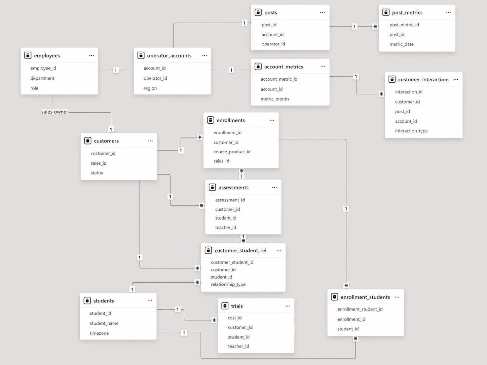
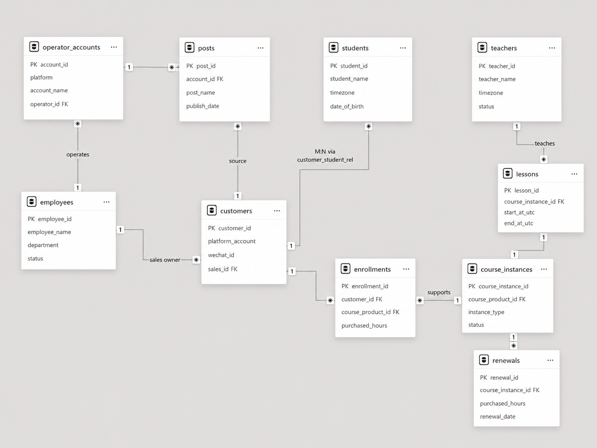
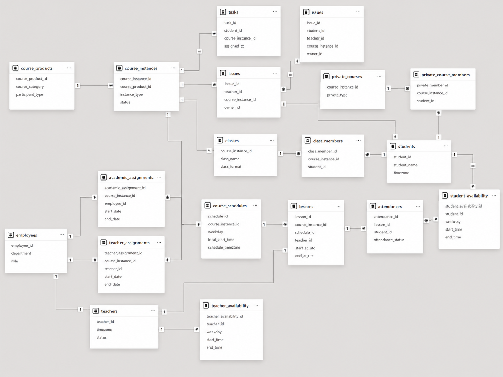
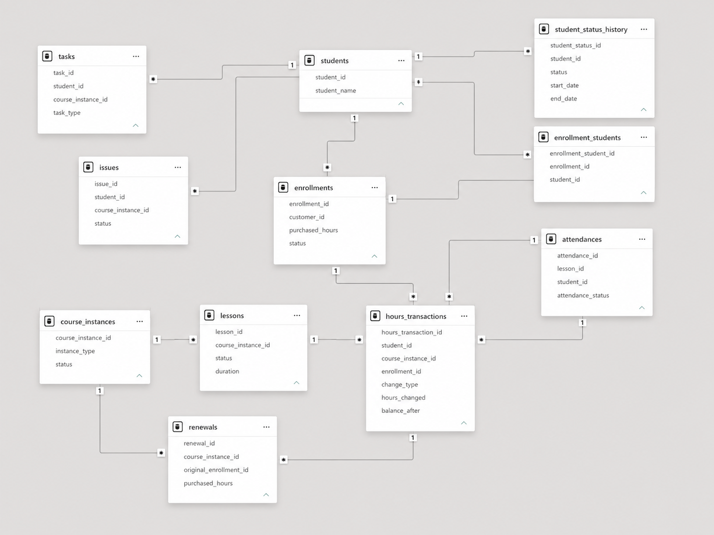

# 05 Data Model

## 1. 文档说明

本文件整合 **05 数据建模第一阶段** 与 **05 数据建模第二阶段**，形成完整的 Data Model 文档，适用于 GitHub Portfolio 展示。

本部分覆盖：

- 业务建模目标与范围；
- 最终核心实体与数据粒度；
- 关键字段、主键、外键；
- 主要关系、基数与约束；
- 时间与时区规则；
- 共享课包与课时流水规则；
- ERD 图像。

---

## 2. 建模目标与范围

本数据模型主要服务于：

- 市场获客分析；
- 销售转化分析；
- 学生生命周期分析；
- 私教与班课运营分析；
- 教师工作量分析；
- 排课调整分析；
- 续费与课时消耗分析；
- 教务任务分析；
- 异常事件分析。

不包含：

- 自动排课；
- 在线预约系统；
- 实时教师日历同步；
- 完整 ERP / Scheduling System。

---

## 3. 建模原则

1. **Customer 与 Student 分离**：咨询人不等于学习者。
2. **Entity 与 Event 分离**：客户主体与客户互动事件分开建模。
3. **Course Product 与 Course Instance 分离**：课程产品不等于实际运行中的课程。
4. **Private Course 与 Class 分离**：私教和班课保留独立业务语义。
5. **历史状态单独建模**：教师分配、教务交接、学生状态、课程排期都保留历史。
6. **共享课包独立核算**：1V2 / 1V3 / 1V4 不按人数重复扣减课时。
7. **统一时间标准**：排课规则保存 `schedule_timezone`，单节课程统一保存 `start_at_utc / end_at_utc`。
8. **分析层与核心关系层分离**：月度统计、同比、环比等指标不进入核心事实表。

---

## 4. 核心实体总览

### 4.1 市场与销售域

| 表名 | 粒度 | 主键 |
|---|---|---|
| employees | 一名内部员工 | employee_id |
| operator_accounts | 一个运营账号 | account_id |
| posts | 一篇帖子 | post_id |
| post_metrics | 一篇帖子在一个统计周期的指标 | post_metric_id |
| account_metrics | 一个账号在一个统计周期的指标 | account_metric_id |
| customers | 一个唯一客户或联系人 | customer_id |
| customer_interactions | 客户的一次点击 / 评论 / 咨询 / 回访 | interaction_id |
| customer_student_rel | 一个客户与一个学习者之间的关系 | customer_student_id |
| trials | 一次试听 | trial_id |
| assessments | 一次等级测试 | assessment_id |

### 4.2 学生与课程域

| 表名 | 粒度 | 主键 |
|---|---|---|
| students | 一个学习者 | student_id |
| course_products | 一个课程产品 | course_product_id |
| enrollments | 一次初次报名 / 购买 | enrollment_id |
| enrollment_students | 一个报名记录所覆盖的一个学生 | enrollment_student_id |
| course_instances | 一个实际运行中的课程实例 | course_instance_id |
| private_courses | 一个私教课程实例的专属属性 | course_instance_id |
| private_course_members | 一个学生加入一个私教课程 | private_member_id |
| classes | 一个班课实例的专属属性 | course_instance_id |
| class_members | 一个学生加入一个班级 | class_member_id |

### 4.3 教务与排课域

| 表名 | 粒度 | 主键 |
|---|---|---|
| teachers | 一名教师 | teacher_id |
| teacher_availability | 教师在某一天的一段连续可授课时间 | teacher_availability_id |
| student_availability | 学生在某一天的一段连续可上课时间 | student_availability_id |
| teacher_assignments | 一名教师在一段时间内负责一个课程实例 | teacher_assignment_id |
| academic_assignments | 一名教务在一段时间内负责一个课程实例 | academic_assignment_id |
| course_schedules | 一个课程的一条固定排课规则 | schedule_id |
| lessons | 一次计划或实际发生的课程 | lesson_id |
| attendances | 一个学生参加一节课程的记录 | attendance_id |
| tasks | 一项教务任务 | task_id |
| issues | 一次异常事件 | issue_id |

### 4.4 生命周期与课时域

| 表名 | 粒度 | 主键 |
|---|---|---|
| student_status_history | 一个学生在一段时间内的一种状态 | student_status_id |
| hours_transactions | 一次课时增加或扣减 | hours_transaction_id |
| renewals | 一次续费行为 | renewal_id |

---

## 5. 关键字段与主外键

### 5.1 核心主键

| 实体 / 表 | 主键 |
| --- | --- |
| Employees | `employee_id` |
| Teachers | `teacher_id` |
| Customers | `customer_id` |
| Students | `student_id` |
| Course Products | `course_product_id` |
| Enrollments | `enrollment_id` |
| Course Instances | `course_instance_id` |
| Lessons | `lesson_id` |
| Renewals | `renewal_id` |
| Hours Transactions | `hours_transaction_id` |

---

### 5.2 核心外键链路

#### 市场与销售

| 子表 | 外键 | 关联主表 | 关联主键 |
| --- | --- | --- | --- |
| `operator_accounts` | `operator_id` | `employees` | `employee_id` |
| `posts` | `account_id` | `operator_accounts` | `account_id` |
| `posts` | `operator_id` | `employees` | `employee_id` |
| `post_metrics` | `post_id` | `posts` | `post_id` |
| `account_metrics` | `account_id` | `operator_accounts` | `account_id` |
| `customers` | `sales_id` | `employees` | `employee_id` |
| `customer_interactions` | `customer_id` | `customers` | `customer_id` |
| `customer_interactions` | `post_id` | `posts` | `post_id` |
| `customer_interactions` | `account_id` | `operator_accounts` | `account_id` |
| `customer_student_rel` | `customer_id` | `customers` | `customer_id` |
| `customer_student_rel` | `student_id` | `students` | `student_id` |
| `trials` | `customer_id` | `customers` | `customer_id` |
| `trials` | `student_id` | `students` | `student_id` |
| `trials` | `teacher_id` | `teachers` | `teacher_id` |
| `assessments` | `customer_id` | `customers` | `customer_id` |
| `assessments` | `student_id` | `students` | `student_id` |
| `assessments` | `teacher_id` | `teachers` | `teacher_id` |

#### 学生与课程

| 子表 | 外键 | 关联主表 | 关联主键 |
| --- | --- | --- | --- |
| `enrollments` | `customer_id` | `customers` | `customer_id` |
| `enrollments` | `course_product_id` | `course_products` | `course_product_id` |
| `enrollments` | `sales_id` | `employees` | `employee_id` |
| `enrollment_students` | `enrollment_id` | `enrollments` | `enrollment_id` |
| `enrollment_students` | `student_id` | `students` | `student_id` |
| `course_instances` | `course_product_id` | `course_products` | `course_product_id` |
| `private_courses` | `course_instance_id` | `course_instances` | `course_instance_id` |
| `private_course_members` | `course_instance_id` | `private_courses` | `course_instance_id` |
| `private_course_members` | `student_id` | `students` | `student_id` |
| `classes` | `course_instance_id` | `course_instances` | `course_instance_id` |
| `class_members` | `course_instance_id` | `classes` | `course_instance_id` |
| `class_members` | `student_id` | `students` | `student_id` |

#### 教务与排课

| 子表 | 外键 | 关联主表 | 关联主键 | 备注 |
| --- | --- | --- | --- | --- |
| `teacher_availability` | `teacher_id` | `teachers` | `teacher_id` |  |
| `student_availability` | `student_id` | `students` | `student_id` |  |
| `teacher_assignments` | `course_instance_id` | `course_instances` | `course_instance_id` |  |
| `teacher_assignments` | `teacher_id` | `teachers` | `teacher_id` |  |
| `academic_assignments` | `course_instance_id` | `course_instances` | `course_instance_id` |  |
| `academic_assignments` | `employee_id` | `employees` | `employee_id` |  |
| `course_schedules` | `course_instance_id` | `course_instances` | `course_instance_id` |  |
| `lessons` | `course_instance_id` | `course_instances` | `course_instance_id` |  |
| `lessons` | `schedule_id` | `course_schedules` | `schedule_id` |  |
| `lessons` | `teacher_id` | `teachers` | `teacher_id` |  |
| `attendances` | `lesson_id` | `lessons` | `lesson_id` |  |
| `attendances` | `student_id` | `students` | `student_id` |  |
| `tasks` | `student_id` | `students` | `student_id` | 可空 |
| `tasks` | `course_instance_id` | `course_instances` | `course_instance_id` | 可空 |
| `tasks` | `assigned_to` | `employees` | `employee_id` |  |
| `issues` | `student_id` | `students` | `student_id` | 可空 |
| `issues` | `teacher_id` | `teachers` | `teacher_id` | 可空 |
| `issues` | `course_instance_id` | `course_instances` | `course_instance_id` | 可空 |
| `issues` | `owner_id` | `employees` | `employee_id` |  |

#### 生命周期与课时

| 子表 | 外键 | 关联主表 | 关联主键 | 备注 |
| --- | --- | --- | --- | --- |
| `student_status_history` | `student_id` | `students` | `student_id` |  |
| `hours_transactions` | `student_id` | `students` | `student_id` |  |
| `hours_transactions` | `course_instance_id` | `course_instances` | `course_instance_id` |  |
| `hours_transactions` | `enrollment_id` | `enrollments` | `enrollment_id` |  |
| `hours_transactions` | `lesson_id` | `lessons` | `lesson_id` | 可空 |
| `hours_transactions` | `renewal_id` | `renewals` | `renewal_id` | 可空 |
| `renewals` | `course_instance_id` | `course_instances` | `course_instance_id` |  |
| `renewals` | `original_enrollment_id` | `enrollments` | `enrollment_id` |  |
| `renewals` | `sales_id` | `employees` | `employee_id` |  |

---

## 6. 主要基数关系

| 主体 | 关系 | 客体 | 基数 |
|---|---|---|---|
| operator_accounts | 发布 | posts | 1:N |
| posts | 产生 | post_metrics | 1:N |
| operator_accounts | 产生 | account_metrics | 1:N |
| customers | 产生 | customer_interactions | 1:N |
| customers | 关联 | students | M:N，经 `customer_student_rel` |
| customers | 产生 | enrollments | 1:N |
| enrollments | 覆盖 | students | M:N，经 `enrollment_students` |
| course_products | 定义 | course_instances | 1:N |
| course_instances | 细分 | private_courses / classes | 1:1 子类型 |
| private_courses | 包含 | students | M:N，经 `private_course_members` |
| classes | 包含 | students | M:N，经 `class_members` |
| course_instances | 关联 | teachers | M:N，经 `teacher_assignments` |
| course_instances | 关联 | employees | M:N，经 `academic_assignments` |
| course_instances | 产生 | course_schedules | 1:N |
| course_instances | 产生 | lessons | 1:N |
| lessons | 包含 | students | M:N，经 `attendances` |
| students | 产生 | student_status_history | 1:N |
| students / course_instances | 产生 | hours_transactions | 1:N |
| course_instances | 产生 | renewals | 1:N |

---

## 7. 关键约束

### 7.1 唯一约束

| 表 | 字段 / 字段组合 | 约束说明 |
| --- | --- | --- |
| `operator_accounts` | `account_name, platform` | 组合唯一 |
| `posts` | `post_id` | 唯一 |
| `customers` | `platform_account` | 可作为业务唯一键，允许为空 |
| `customer_student_rel` | `customer_id, student_id, status` | 组合需防止重复 |
| `enrollment_students` | `enrollment_id, student_id` | 组合唯一 |
| `private_course_members` | `course_instance_id, student_id, status` | 组合需防止重复 |
| `class_members` | `course_instance_id, student_id, status` | 组合需防止重复 |
| `teacher_assignments` | `course_instance_id, teacher_id, start_date` | 组合唯一 |
| `academic_assignments` | `course_instance_id, employee_id, start_date` | 组合唯一 |
| `attendances` | `lesson_id, student_id` | 组合唯一 |

---

### 7.2 检查约束

| 表 | 字段 | 检查规则 | 说明 |
| --- | --- | --- | --- |
| `teachers` | `timezone` | 必须为合法 IANA 时区 | 例如 `Europe/Madrid` |
| `students` | `timezone` | 必须为合法 IANA 时区 | 例如 `Asia/Shanghai` |
| `course_schedules` | `schedule_timezone` | 必须为合法 IANA 时区 | 用于课程排课时区 |
| `teacher_availability` | `start_time`, `end_time` | `start_time < end_time` | 开始时间必须早于结束时间 |
| `student_availability` | `start_time`, `end_time` | `start_time < end_time` | 开始时间必须早于结束时间 |
| `lessons` | `start_at_utc`, `end_at_utc` | `start_at_utc < end_at_utc` | 课程开始时间必须早于结束时间 |
| `hours_transactions` | `change_type` | `IN ('increase', 'decrease')` | 仅允许增加或减少两种类型 |
| `hours_transactions` | `hours_changed` | `hours_changed > 0` | 课时变动数量必须大于 0 |
| `renewals` | `purchased_hours` | `purchased_hours > 0` | 续费购买课时必须大于 0 |
| `enrollments` | `purchased_hours` | `purchased_hours > 0` | 首次报名购买课时必须大于 0 |

### 7.3 历史记录规则

- 教师离职后不删除 `teachers` 记录；
- 课程换老师时新增 `teacher_assignments`，不覆盖旧记录；
- 教务交接时新增 `academic_assignments`，不覆盖旧记录；
- 学生状态变化记录到 `student_status_history`；
- 固定排课调整新增新的 `course_schedules` 记录，结束旧记录；
- 课程时间变更体现在具体 `lessons` 上。

---

## 8. 时间与时区规则

### 8.1 人员时区

教师和学生分别保存自己的标准 IANA 时区，例如：

- `Europe/Madrid`
- `Asia/Shanghai`
- `America/New_York`

### 8.2 教师可用时间

`teacher_availability` 按照教师本地时区记录。

同一教师在同一天可有多段不连续时间，每段连续时间一行。

### 8.3 学生时间偏好

`student_availability` 按照学生本地时区记录。

同一学生在同一天可有多段不连续时间，每段连续时间一行。

### 8.4 排课规则

`course_schedules` 必须指定：

- `weekday`
- `local_start_time`
- `schedule_timezone`

例如：

- `Sunday`
- `10:00`
- `Europe/Madrid`

表示课程按马德里当地时间每周日 10:00 排课。

### 8.5 单节课程时间

`lessons` 统一保存：

- `start_at_utc`
- `end_at_utc`

不重复保存：

- 教务马德里时间；
- 教师当地时间；
- 学生当地时间。

这些展示时间由 `UTC + timezone` 动态计算。

---

## 9. 共享课包与课时流水规则

### 9.1 共享课包

1V2 / 1V3 / 1V4 使用共享课包。

例如：

- 学生 A + 学生 B
- 购买 60 小时 1V2 课程

则这 60 小时为一个共享课包。

### 9.2 课时扣减

完成 1 节 1 小时课程时：

- 只产生 1 条 `hours_transactions` 扣减流水；
- 课包余额减少 1 小时；
- 不按学生人数重复扣减。

### 9.3 课时增加

- 初次报名：增加一条课时流水；
- 续费：增加一条课时流水；
- 人工补课时 / 退课时：增加或减少对应流水。

### 9.4 余额口径

`hours_transactions.balance_after` 保存本次变动后的余额。

核心口径：

`当前剩余课时 = 所有增加课时 - 所有扣减课时`

---

## 10. ERD 图像

> 为了可读性，本项目采用 **1 张总览图 + 3 张主题图** 的方式展示 ERD。

### 10.1 总览图

### 10.2 市场与销售域

### 10.3 课程与教务域

### 10.4 课时与学生生命周期域

---

## 11. 当前数据与目标模型的关键映射

| 当前数据 | 目标模型 |
|---|---|
| 小红书广告点击 / 私信 / 评论 | `customer_interactions` |
| 客户基本信息 | `customers` |
| 家长与学生关系 | `customer_student_rel` |
| 试听记录 | `trials` |
| 等级测试记录 | `assessments` |
| 学生基本信息 | `students` |
| 课程产品配置 | `course_products` |
| 报名记录 | `enrollments` |
| 多学生共享课包 | `enrollment_students` |
| 私教 / 班课实例 | `course_instances` + 子类型表 |
| 教师可授课时间 | `teacher_availability` |
| 学生可上课时间 | `student_availability` |
| 固定排课规则 | `course_schedules` |
| 月内具体课程 | `lessons` |
| 课程出勤 | `attendances` |
| 课时增加 / 扣减 | `hours_transactions` |
| 学生状态变化 | `student_status_history` |
| 续费 | `renewals` |
| 教务任务 | `tasks` |
| 异常反馈 | `issues` |

---

## 12. 分析层边界

以下内容不作为核心关系事实表，而是在分析阶段生成：

- 月度学生数
- 新增学生数
- 私教新增
- 班课新增
- 试听转化率
- 报名转化率
- 续费率
- 开班率
- 学生环比 / 同比
- 教师授课课时
- 课时消耗
- 剩余课时
- 改课率
- 取消率
- 异常事件统计

输出形式：

`SQL 分析结果 -> 月度分析表 -> Power BI Dashboard -> 月度业务报告`

---

## 13. 下一步

在完成 Data Model 后，下一步进入：

- **06 数据清洗与 ETL**
  - 根据本模型定义原始 Excel 字段映射；
  - 处理主键生成、去重、清洗与时间转换；
  - 将原始表拆分到对应目标表；
  - 为 SQL 分析和 BI 建模准备干净数据。